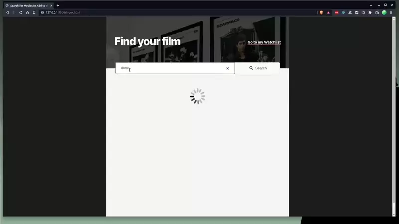
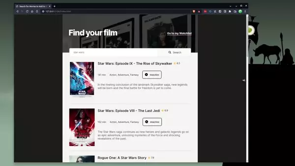

## Table of contents

- [Overview](#overview)
  - [The challenge](#the-challenge)
  - [Screenshot](#screenshot)
  - [Links](#links)
- [My process](#my-process)
  - [Built with](#built-with)
  - [What I learned](#what-i-learned)
  - [Continued development](#continued-development)
- [Author](#author)

## Overview

This solo project is from the Scrimba Front End Developper course.
This was my first 'full scale' project that would include building 2 HTML webpages, the CSS stylesheet, the JavaScript code from scratch. In order to consolidate my learning I wanted to do everything vanilla, no JS or CSS framework, reset or normalize.

### The challenge Requirement

Users should be able to:

- See hover states for interactive elements
- two pages index.html and watchlist.html
- index = search page. Calls to OMDB API with teh title searched for and displays search results
- Button to "add to watchlist" which saves that data to local storage
- Watchlist.html loads and displays data from local storage

### Screenshot

### Links

- [GitHub Repo](https://github.com/Poukame/Movie-Watchlist)
- Live Demo : [Movie Search and Watchlist](https://movie-watchlist-api.netlify.app)

## My process

Initially I started to build the layout, but I realized I started with a large width which brought me problems down the line.

I then restarted from scratch with a mobile first approach and managed to get a fully responsive layout with a much leaner code.

Once the layout was solid enough, I started to code the JavaScript part to get the interactivity with the interface and the API. I got stuck for a while because I wanted the results to be sorted by date. I googled around and ask for help and eventually managed to get over the problem.

For the JavaScript my main goal was to get a modular code with as few variables outside of functions as possible.

### Built with

- Semantic HTML5 markup
- CSS3
- Flexbox
- Mobile-first workflow
- Vanilla JavaScript
- Based on Figma Design

### What I learned

The main learning points are :
- Connecting to an API using async function and error handling,
- start from mobile first approach,
- get a modular structure and chain function in order to have an easier maintainable and readable code.

### Continued development

I used flexbox during this project because I didn't know about grid yet. Since then I've learned it and would like to do project using grids.
Since this project I've learned much more about CSS and how to make it "DRYer", mainly using var(). I think it's an area I need to improve in future projects.

## Author

- GitHub - [Poukame](https://github.com/Poukame)
- Frontend Mentor - [@Poukame](https://www.frontendmentor.io/profile/Poukame)
- LinkedIn - [Guillaume](https://www.linkedin.com/in/theretg)

