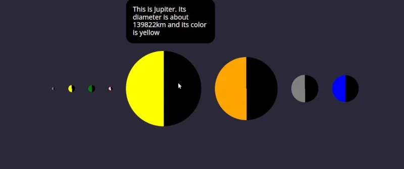

## Overview

This project is part of the June 2022 challenge week from Scrimba.

## Challenges Requirements

Using the data array, display the planets using JS only.

### Screenshot

### Links

- [GitHub Repo](https://github.com/Poukame/Movie-Watchlist)
- Live Demo : [Solar System](https://movie-watchlist-api.netlify.app)

## Author

- GitHub - [Poukame](https://github.com/Poukame)
- Frontend Mentor - [@Poukame](https://www.frontendmentor.io/profile/Poukame)
- LinkedIn - [Guillaume](https://www.linkedin.com/in/theretg)

