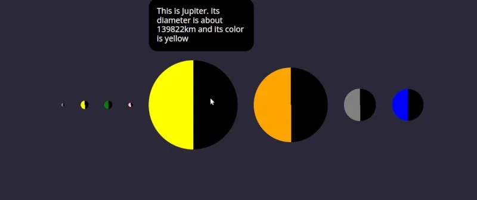

## Overview

This project is part of the June 2022 challenge week from Scrimba.

## Challenges Requirements

Write a function to display a galaxy of stars (at least 100) in the DOM.

- 1. Ensure that the stars always fill each line
- 2. Add different sizes of star 

### Screenshot

### Links

- [GitHub Repo](https://github.com/Poukame/Movie-Watchlist)
- Live Demo : [Solar System](https://movie-watchlist-api.netlify.app)

## Author

- GitHub - [Poukame](https://github.com/Poukame)
- Frontend Mentor - [@Poukame](https://www.frontendmentor.io/profile/Poukame)
- LinkedIn - [Guillaume](https://www.linkedin.com/in/theretg)

