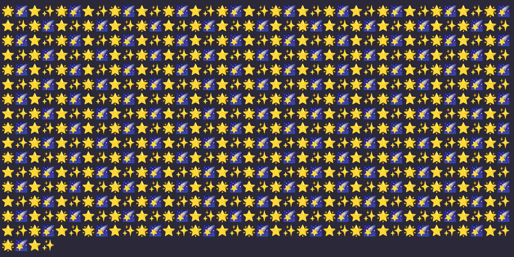

## Overview

This project is part of the June 2022 challenge week from Scrimba.

## Challenges Requirements

Write a function to display a galaxy of stars (at least 100) in the DOM.

### Screenshot

### Links

- [GitHub Repo](https://github.com/Poukame/solo-projects-learning/tree/main/Scrimba%20Challenge%20-%20June%202022/Day%202%20-%20Render%20Stars)

## Author

- GitHub - [Poukame](https://github.com/Poukame)
- Frontend Mentor - [@Poukame](https://www.frontendmentor.io/profile/Poukame)
- LinkedIn - [Guillaume](https://www.linkedin.com/in/theretg)

