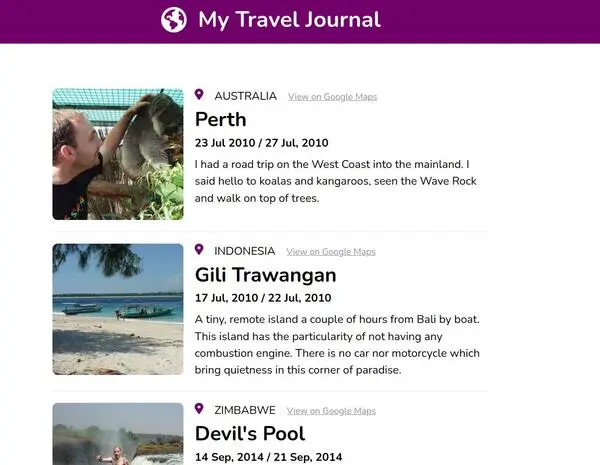
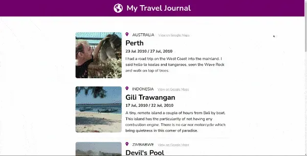

## Overview

This was my second project using React. The goal was to create a database with our travel experiences and render them in the form of cards in the DOM.
The travels experiences listed here are really mine. I have travelled a lot and have much more memories than what I put in this project. I'd be happy to share travelling memories with you.

### Screenshot




### Links

- [GitHub Repo](https://github.com/Poukame/solo-projects-learning/tree/main/Travel%20Journal%20-%20React%20Solo%20Project)
- Live Demo : [Professional Card](https://professional-card-react.netlify.app/)

## My process

Design wise I started with a mobile first approach. I also tried to apply CSS concepts I learned recently such as the 'lobotomized owl' and the dynamic font-size with a line such as :

```font-size: min(calc(0.7em + 1vw), 18px);```

### Built with

- React App
- Based on Figma Design
- Visual Studio Code
- NPM

### What I learned

The main learning points are :
- Using React props
- Getting more familiar with the React logic

## Author

- GitHub - [Poukame](https://github.com/Poukame)
- Frontend Mentor - [@Poukame](https://www.frontendmentor.io/profile/Poukame)
- LinkedIn - [Guillaume](https://www.linkedin.com/in/theretg)

