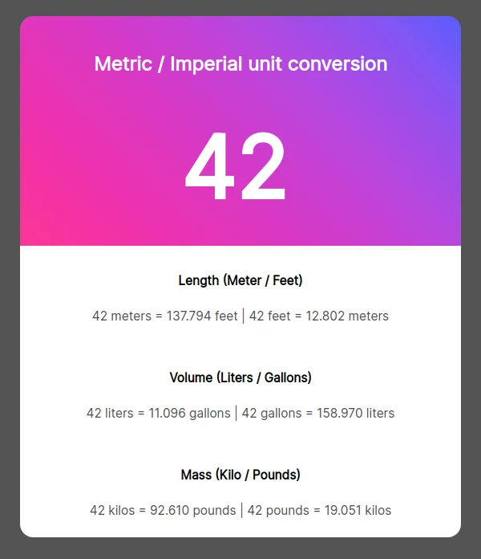

## Overview

This solo project is from the Scrimba Front End Developper course.
I did this project after 1 week of learning HTML / CSS and JavaScript.

### Screenshot

### Links

- [GitHub Repo](https://github.com/Poukame/solo-projects-learning/tree/main/Unit%20Converter%20-%20Solo%20Project)
- Live Demo : [Unit Converter](https://eloquent-custard-837b06.netlify.app)

## Author

- GitHub - [Poukame](https://github.com/Poukame)
- Frontend Mentor - [@Poukame](https://www.frontendmentor.io/profile/Poukame)
- LinkedIn - [Guillaume](https://www.linkedin.com/in/theretg)

