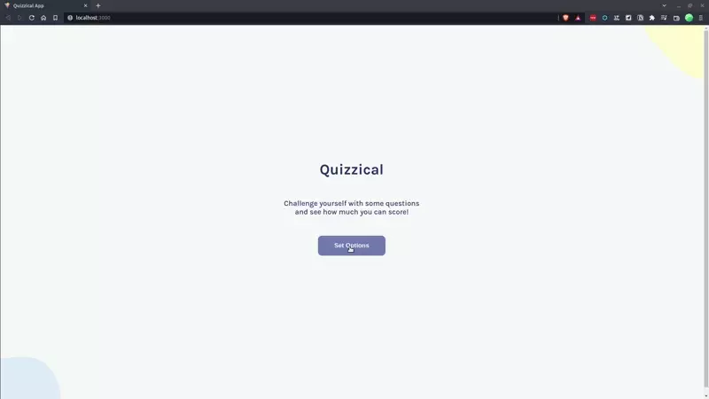

# Quizzical - 29th July 2022

## Table of contents

- [Overview](#overview)
  - [The challenge](#the-challenge)
  - [Screenshot](#screenshot)
  - [Links](#links)
- [My process](#my-process)
  - [Built with](#built-with)
  - [What I learned](#what-i-learned)
  - [Continued development](#continued-development)
- [Author](#author)

## Overview

This solo project is from the Scrimba Front End Developper course.
The goal was to build a a quiz using the provided Figma design and the trivia API (https://opentdb.com/api_config.php) to fetch the data.

This was a really challenging project. I blocked a couple of times in the process but by reading the React Documentation and aksing for help I managed to overcome the challenges.

Overall, this project allowed me to really consolidate the React basics.

### The challenge Requirement

Users should be able to:

- Select the answers
- See the corrects and wrong answers after checking for the result
- See the final score

I added extras :
- Ability to choose the question category, the difficulty and the number of questions
- Error message if the API call fails or if the user uses a VPN.
- End animation if the user scores more than 50%
- Ability to start a new game
- Loading spinning wheel

### Screenshot

### Links

- [GitHub Repo](https://github.com/Poukame/solo-projects-learning/tree/main/quizzical%20-%20React%20Solo%20Project)
- Live Demo : [Quizzical](https://unique-zabaione-b717a2.netlify.app/)

## My process

I started with the layout starting with the mobile design.

Then I coded the logic part but I found out the component tree structure I had chosen wasn't ideal.
I refactored everything almost from scratch and finally managed to make it work. I faced a component re-rendering problem which I couldn't solved at first. I decided to use `localStorage` to fix this issue.

### Built with

- React
- Vite
- NPM (nanoid, Confetti)

### Continued development

I feel there are too many props passing down. I think I could use `useContext` to simply the code a bit more.
I also think I may use `useReducer` to manage the state in a better way.

This is definitely something I will try to do on my next project.

## Author

- GitHub - [Poukame](https://github.com/Poukame)
- Frontend Mentor - [@Poukame](https://www.frontendmentor.io/profile/Poukame)
- LinkedIn - [Guillaume](https://www.linkedin.com/in/theretg)

## Useful Resources I Used

- CSS prefixer : https://autoprefixer.github.io/
- CSS style for the form : https://www.sliderrevolution.com/resources/css-select-styles/
- CSS style for the incremental button : https://get.foundation/building-blocks/blocks/plus-minus-input.html
- CSS for the loading spinner : https://css-tricks.com/single-element-loaders-the-spinner/

